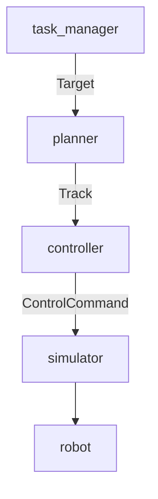

# Readme

英文文档待撰写

## Introduction

本项目是一个基于 Rust 的机器人实验平台，在这里，您只需要通过选择已经写好的控制器与规划器（当然，自己编写的也完全可以），就可以快速地搭建起一个机器人的实验环境，而无需担心通讯、节点管理、线程管理等一系列麻烦的事情，只需要专注于您的算法实现。

### why Rust?

实际上我们的工作与 matlab 中 simulink 很是相似，都是期望能够模块化的搭建一个实验平台。但是本系统采用 rust 出于以下几方面的考虑：

1. Rust 是一门系统级别的语言，其性能与 C 语言相当，得益于其零成本抽象，在部分情况下其性能甚至优于C++
2. Rust 在安全性上有着相当好的表现，这对于机器人实验平台来说，运行时的代码安全性直接关乎到实验设备的安全性。
3. Rust 的静态类型系统使得我们几乎可以实现编码完成=运行成功。而无需面对令人焦头烂额的运行时错误和漫长的debug过程。这点想必此前使用 C++/ros 的同学们深有体会。

总而言之我们一方面希望能够像 simulink 一样提供一个模块化的实验平台，另一方面我们也追求最优的运行时性能和代码安全性。Rust 无疑是最好的选择了。

至于 Rust 陡峭的学习曲线，我们在系统搭建的过程中已经尽量完成了其中较为复杂的部分，在具体的控制器和规划器的实现中，实际上更多的还是常见的矩阵乘法等数学运算，而无需担忧所有权、生命周期等令人头大的概念。剩余的这点难度，就当时本系统的小小门槛吧。

### Ros?

我们确实保留了 `ros` 接口，您分别可以用 `-feature ros` 和 `-feature ros2` 启动响应的对外接口（这当然要求您的计算机已经安装配置好了 `ros` 或者 `ros2` 的环境，这通常是在 `ubuntu` 下）。当然，我们也提供了避开 `ros` 的方案（此时您不可以使用rviz等 `ros` 工具，但是仍然可以使用其他的仿真器工具如 `pybullet` 等）以供您在 `windows` 或者其他不想配置 ros 的环境下使用。

### 多机械臂协作？

这当然是可以的，我们的系统希望能够支持多种不同类型的机械臂同时协作，这只需要一个机器人对应的参数文件即可。

同时，我们的系统也可以仿真与真实机器人同步协作，您可以选择您的机器人集群中部分机器人采用不同型号的真实机器人，部分机器人采用不同的仿真器进行仿真。系统将会自动处理来自不同消息源的数据信息，并根据您的要求完成协作任务。

## Quick Start

环境要求：

- rust nightly版本
- python 3.10+
- （可选）ros noetic 或者 ros2

请克隆本项目到本地：

```bash
git clone git@github.com:Robot-Exp-Platform/Robot-Platform.git
```

在项目根目录中检查是否有系统架构文件和任务参数文件，一个直接可用的例子是：

```json
// config.json
{
  "name": "panda_1",
  "robot_type": "panda",
  "controller": "pid",
  "planner": "linear",
  "simulator": "bullet"
}
```

```json
// task.json
{
  "robot_tasks": [
    {
      "name": "linear:panda_1",
      "targets": [
        { "Joint": [0.0, -0.7854, 0.0, -2.3562, 0.0, 1.5708, 0.7854] },
        { "Joint": [0.0, -0.7854, 0.0, -2.3562, 0.0, 1.5708, 0.7854] },
        { "Joint": [0.0, -0.7854, 0.0, -2.3562, 0.0, 1.5708, 0.7854] }
      ]
    }
  ],

  "nodes": [
    { "node_type": "planner", "name": "linear:panda_1", "param": { "period": 5, "interpolation": 10 } },
    {
      "node_type": "controller",
      "name": "pid:panda_1",
      "param": {
        "period": 0.5,
        "kp": [
          1.0, 0.0, 0.0, 0.0, 0.0, 0.0, 0.0, 0.0, 1.0, 0.0, 0.0, 0.0, 0.0, 0.0, 0.0, 0.0, 1.0, 0.0, 0.0, 0.0, 0.0, 0.0, 0.0, 0.0, 1.0, 0.0, 0.0, 0.0,
          0.0, 0.0, 0.0, 0.0, 1.0, 0.0, 0.0, 0.0, 0.0, 0.0, 0.0, 0.0, 1.0, 0.0, 0.0, 0.0, 0.0, 0.0, 0.0, 0.0, 1.0
        ],
        "ki": [
          0.0, 0.0, 0.0, 0.0, 0.0, 0.0, 0.0, 0.0, 0.0, 0.0, 0.0, 0.0, 0.0, 0.0, 0.0, 0.0, 0.0, 0.0, 0.0, 0.0, 0.0, 0.0, 0.0, 0.0, 0.0, 0.0, 0.0, 0.0,
          0.0, 0.0, 0.0, 0.0, 0.0, 0.0, 0.0, 0.0, 0.0, 0.0, 0.0, 0.0, 0.0, 0.0, 0.0, 0.0, 0.0, 0.0, 0.0, 0.0, 0.0
        ],
        "kd": [
          0.0, 0.0, 0.0, 0.0, 0.0, 0.0, 0.0, 0.0, 0.0, 0.0, 0.0, 0.0, 0.0, 0.0, 0.0, 0.0, 0.0, 0.0, 0.0, 0.0, 0.0, 0.0, 0.0, 0.0, 0.0, 0.0, 0.0, 0.0,
          0.0, 0.0, 0.0, 0.0, 0.0, 0.0, 0.0, 0.0, 0.0, 0.0, 0.0, 0.0, 0.0, 0.0, 0.0, 0.0, 0.0, 0.0, 0.0, 0.0, 0.0
        ]
      }
    },
    { "node_type": "simulator", "name": "bullet:panda_1", "param": "" }
  ]
}

```

最简样例中采用了 Franka Emika Panda 机械臂，使用了 pid 控制器和 linear 规划器，使用 bullet 仿真器进行仿真。您可以根据自己的需求修改这两个文件。

在根目录中运行：

```bash
cargo build
cargo run --release
```

或者仅仅运行：

```bash
cargo build
cargo run
```

您就可以看到机械臂在仿真器中运动了。同时命令行中会输出机械臂的状态信息和规划控制信息。

## Documentation

暂且还不完备，02 阶段完成后会整理文档

## Contribution Guidelines


### 代码风格

在本系统中诸多代码需各自遵循以下代码规范：

- rust rustfmt 需要安装 rust-analyzer 插件
- python pylint 需要安装 pylint 插件
- markdown markdownlint 需要安装 markdownlint 插件

推荐的报错插件和注释插件为：

- error lens
- better comments

其中部分约束并非强制要求，建议在 ./vscode/settings.json 中添加以下配置：

```json
//*? 以下是对 markdownlint 的配置
  "markdownlint.config": {
    "default": true,
    "MD025": false,
    "MD033": false,
    "MD024": false
  },
  "pylint.args": ["--disable=C0116,I1101", "--max-line-length=120"],
  "flake8.args": ["--max-line-length=120"]
```

### 系统结构

整个实验实际上是基于一个实验对象： Exp

```rust
pub struct Exp {
    // Exp 是一个森林状的结构，其中的包含 robot tree, controller tree, planner tree 等等树状结构的根节点，通过管理 exp 实现管理整个结构的目的
    pub thread_manage: ThreadManage,
    pub task_manage: TaskManager,

    pub robot_exp: Arc<RwLock<dyn robot::Robot>>,
    pub planner_exp: Arc<Mutex<dyn planner::Planner>>,
    pub controller_exp: Arc<Mutex<dyn controller::Controller>>,
    pub simulator_exp: Arc<Mutex<dyn simulator::Simulator>>,
}
```

其中包含一个线程管理器、一个任务管理器和一些树状结构的根节点。

对于单机器人结构，其结构如流程图所是：



当多机器人时，robot 树中每个叶节点对应一个机器人，每个机器人都有其对应的 planner, controller, simulator。所以这几棵子树的形状保持一致。

每个 节点，包含 planner, controller, simulator, 都实现了 RosThread 特征，线程管理器将管理所有的节点线程。

```rust
pub trait ROSThread: Send + Sync {
    fn init(&mut self) {}
    fn start(&mut self) {}
    fn update(&mut self) {}
    fn get_period(&self) -> Duration {
        Duration::from_secs(0)
    }
}
```

```rust
pub struct ThreadManage {
    threads: Vec<thread::JoinHandle<()>>,
    pub condvar: Arc<(AtomicBool, Condvar, Mutex<()>)>,
}

impl ThreadManage {
  pub fn add_thread(&mut self, node: Arc<Mutex<dyn ROSThread>>) {
        let condvar = self.condvar.clone();
        let node = node.clone();
        let thread = thread::spawn(move || {
            let mut node_lock = node.lock().unwrap();
            node_lock.init();
            drop(node_lock);
            let (flag, cvar, lock) = &*condvar;
            loop {
                let mut locked = lock.lock().unwrap();
                while !flag.load(Ordering::SeqCst) {
                    locked = cvar.wait(locked).unwrap();
                }
                drop(locked);

                let mut node_lock = node.lock().unwrap();
                node_lock.start();
                let period = node_lock.get_period();
                while flag.load(Ordering::SeqCst) {
                    let start_time = Instant::now();

                    node_lock.update();

                    let elapsed_time = start_time.elapsed();
                    if period > elapsed_time {
                        thread::sleep(period - elapsed_time);
                    }
                }
                drop(node_lock);
            }
        });
        self.threads.push(thread);
    }

    pub fn start_all(&self) {
        let (flag, cvar, _) = &*self.condvar;
        flag.store(true, Ordering::SeqCst);
        cvar.notify_all();
    }

    pub fn stop_all(&self) {
        let (flag, _, _) = &*self.condvar;
        flag.store(false, Ordering::SeqCst);
    }
}
```

这里使用了 condvar 作为线程开关， 控制所有线程的同时启动和停止。

### 节点通讯与实验流程

节点之间的通讯是通过消息队列实现的，在创建节点的时候为对应节点设置消息队列，节点之间通过消息队列进行通讯。

目前存在的通讯有：

- task_manager/Exp --(Target)-> planner
- planner --(Track)-> controller
- controller --(ControlCommand)-> simulator
