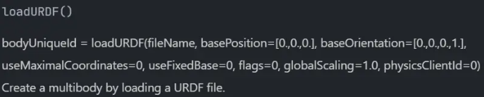

# pybullet相关文档

> 参考知乎博客：https://zhuanlan.zhihu.com/p/347078711 系列
> 官方文档：https://docs.google.com/document/d/10sXEhzFRSnvFcl3XxNGhnD4N2SedqwdAvK3dsihxVUA/edit

## 安装pybullet

万事开头难，因此对于pybullet来说最难的一步就是安装（bushi）。pybullet的安装非常简单，只需要一行命令：
```
pip install pybullet
```

## 基本操作

借助以下例子来说明：

```python
import pybullet as p
import time
import pybullet_data

# 连接物理引擎
physicsCilent = p.connect(p.GUI)

# 添加资源路径
p.setAdditionalSearchPath(pybullet_data.getDataPath())

# 设置环境重力加速度
p.setGravity(0, 0, -10)

# 加载URDF模型，此处是加载蓝白相间的陆地
planeId = p.loadURDF("plane.urdf")

# 加载机器人，并设置加载的机器人的位姿
startPos = [0, 0, 1]
startOrientation = p.getQuaternionFromEuler([0, 0, 0])
boxId = p.loadURDF("r2d2.urdf", startPos, startOrientation)

# 按照位置和朝向重置机器人的位姿，由于我们之前已经初始化了机器人，所以此处加不加这句话没什么影响
p.resetBasePositionAndOrientation(boxId, startPos, startOrientation)

# 开始一千次迭代，也就是一千次交互，每次交互后停顿1/240
for i in range(1000):
    p.stepSimulation()
    time.sleep(1 / 240)

# 获取位置与方向四元数
cubePos, cubeOrn = p.getBasePositionAndOrientation(boxId)
print("-" * 20)
print(f"机器人的位置坐标为:{cubePos}\n机器人的朝向四元数为:{cubeOrn}")
print("-" * 20)

# 断开连接
p.disconnect()
```

### connect

该函数的作用为连接物理引擎，整个pybullet的结构可以理解为客户端和服务端，客户端发送指令，服务端来执行。为了让我们在客户端编写的脚本能够被解释，并在物理引擎运行整个环境，需要使用pybullet的connect方法。

上述代码中我们使用如下代码连接物理引擎：
```python
# 连接物理引擎
physicsCilent = p.connect(p.GUI)
```
connect函数接受一个参数，代表用户选择连接的物理引擎服务器（physics server），可选的有`pybullet.GUI`和`pybullet.DIRECT` ，返回一个数字代表服务器的ID。这两个物理引擎执行的内容，返回的结果等方面完全一致，唯一区别是，GUI可以实时渲染场景到图形化界面上，而DIRECT则不会且不允许用户调用内置的渲染器，也不允许用户调用外部的openGL，VR之类的硬件特征，但好处是不需要渲染图形化界面，因此在不需要展示的情况下运行效率会更高。
其他相关内容可以参考官方文档。

### disconnect

使用该函数可以关闭指定的物理服务器，接收参数为服务器ID，默认为0，即创建的第一个服务器。

### setGravity

人如其名，该函数用于设置环境加速度，在例子中调用如下，相信大家都能看懂参数含义）
```python
# 设置环境重力加速度
p.setGravity(0, 0, -10)
```

### loadURDF

```python
# 加载URDF模型，此处是加载蓝白相间的陆地
planeId = p.loadURDF("plane.urdf")

# 加载机器人，并设置加载的机器人的位姿
startPos = [0, 0, 1]
startOrientation = p.getQuaternionFromEuler([0, 0, 0])
boxId = p.loadURDF("r2d2.urdf", startPos, startOrientation)
```
pybullet提供了非常方便的函数loadURDF来加载外部的urdf文件，返回值是创建的模型对象的ID，接受的参数有8个，只有第一个是必填参数：

参数fileName代表需要加载的urdf模型的绝对路径，如果你将urdf文件放在了一个文件夹下，可以使用setAdditionalSearchPath()方法来添加loadURDF的搜索路径。
在上述例子中，我们使用了pybullet_data.getDataPath()函数获取到pybullet库中自带模型的路径，以此作为参数传入setAdditionalSearchPath()函数，因此后续能够直接加载该路径中的模型。

### stepSimulation

该函数为进行一步迭代仿真，此后的time.sleep()为延时，最恰当的延时时间是1/240。
此外还可以使用setRealTimeSimulation进行模拟仿真，则不需要进行显式的延时，即可以将例子中的
```python
for i in range(1000):
    p.stepSimulation()
    time.sleep(1 / 240)
```
更换为：
```python
p.setRealTimeSimulation(1)
while True:
    pass
```
我们也可以用setTimeStep函数来调整stepSimulation的频率，但建议大部分情况下不要去动该频率，按照默认值即可。